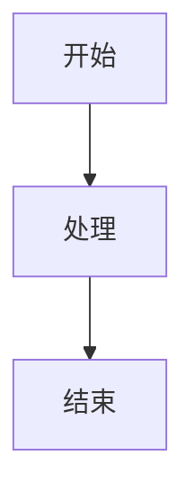

# 🔍 Mermaid功能调试测试

## 测试目的
验证Mermaid图表在预览区域是否正常显示。

## 测试步骤
1. 将此文档内容复制到编辑器
2. 查看预览区域是否显示图表
3. 检查浏览器控制台是否有调试信息

## 简单流程图测试

## 如果上面的图表没有显示
请检查：
1. 浏览器控制台是否有错误信息
2. 是否看到"Detected Mermaid code block"的调试信息
3. 是否看到"Rendering Mermaid diagram"的调试信息

## 预期结果
- 应该看到一个简单的流程图
- 包含三个节点：开始 → 处理 → 结束
- 图表应该有边框和背景色

## 如果仍然不显示
可能的原因：
1. Mermaid依赖没有正确加载
2. 代码块语言识别有问题
3. 组件渲染有问题
