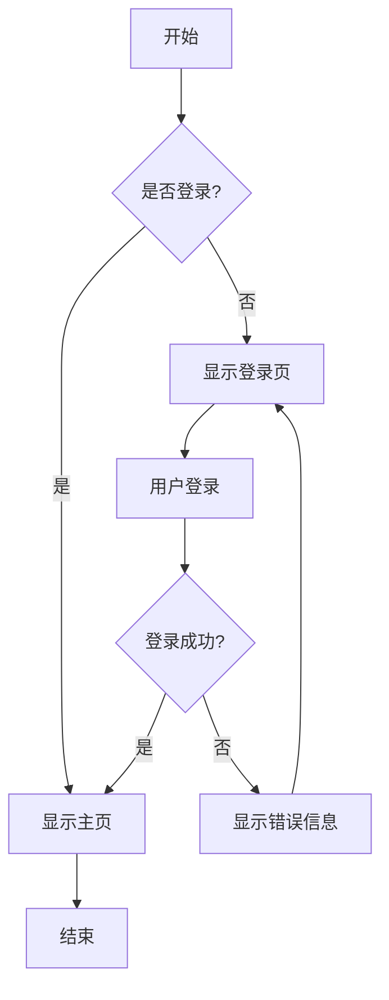
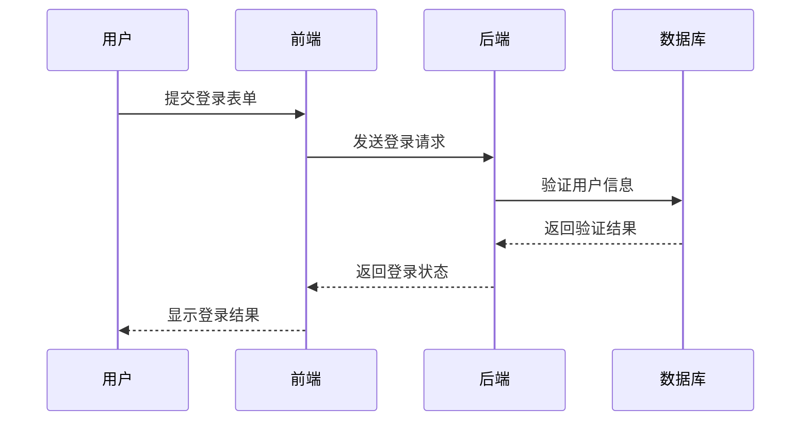
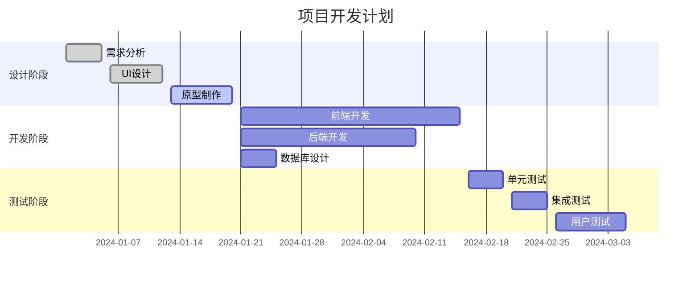
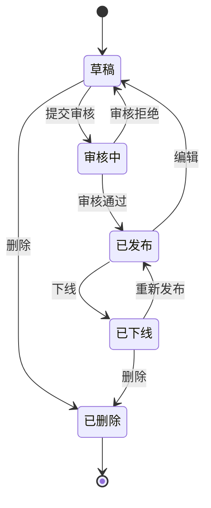
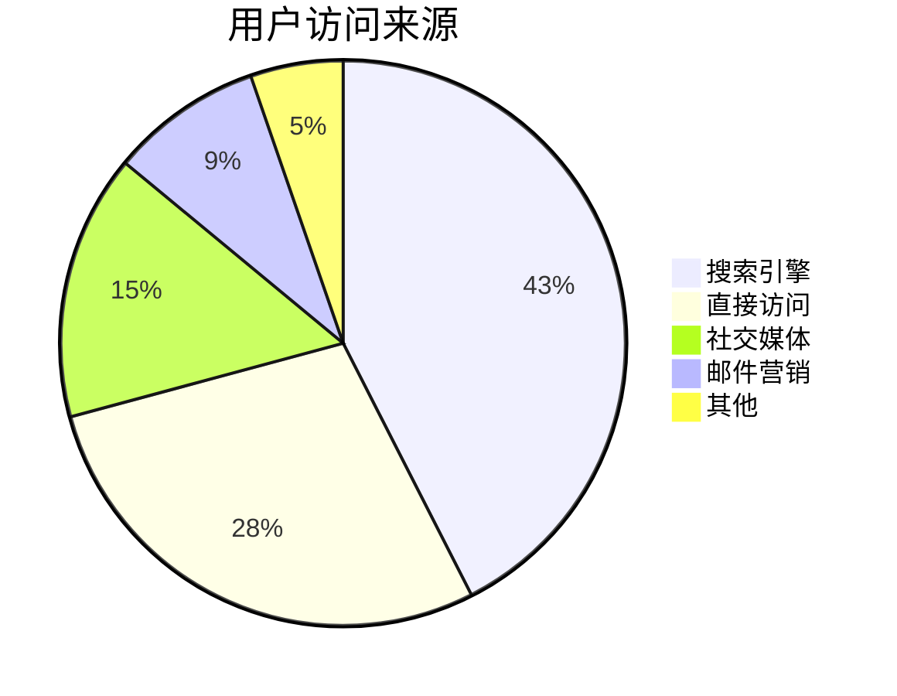
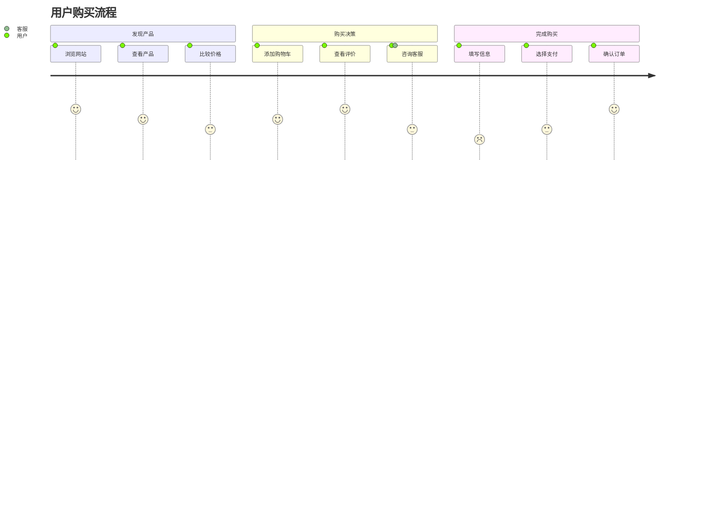
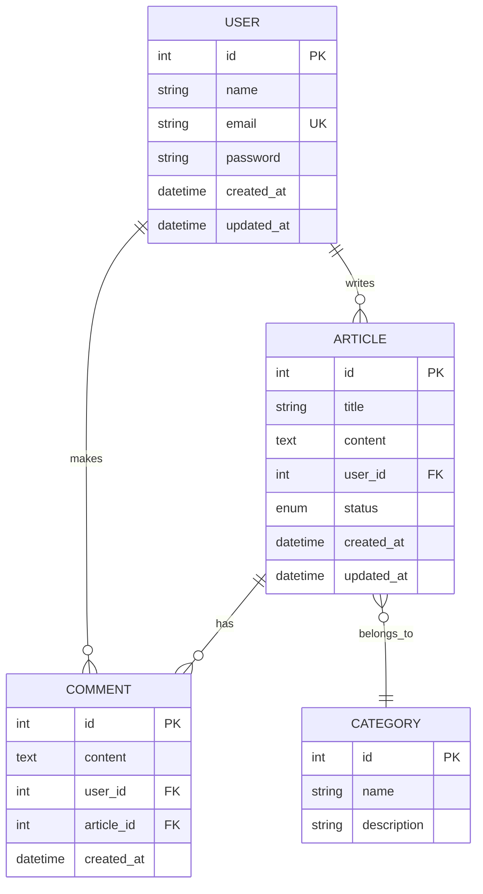
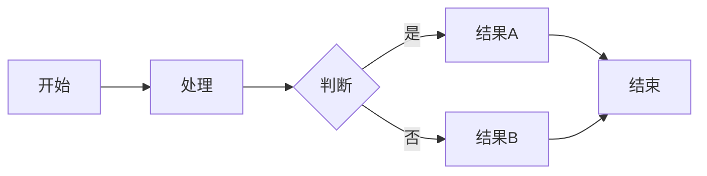

# 🎨 Mermaid流程图测试文档

## 🎯 测试目的
验证Markdown编辑器中的Mermaid流程图渲染功能是否正常工作。

## 📋 支持的图表类型

### 1. 流程图 (Flowchart)


### 2. 时序图 (Sequence Diagram)


### 3. 甘特图 (Gantt Chart)


### 4. 类图 (Class Diagram)
```mermaid
classDiagram
    class User {
        +String name
        +String email
        +String password
        +login()
        +logout()
        +updateProfile()
    }
    
    class Article {
        +String title
        +String content
        +Date createdAt
        +Date updatedAt
        +publish()
        +unpublish()
        +delete()
    }
    
    class Comment {
        +String content
        +Date createdAt
        +approve()
        +reject()
    }
    
    User ||--o{ Article : writes
    Article ||--o{ Comment : has
    User ||--o{ Comment : makes
```

### 5. 状态图 (State Diagram)


### 6. 饼图 (Pie Chart)


### 7. 用户旅程图 (User Journey)


### 8. Git图 (Git Graph)
```mermaid
gitgraph
    commit id: "初始提交"
    branch develop
    checkout develop
    commit id: "添加登录功能"
    commit id: "添加用户管理"
    checkout main
    merge develop
    commit id: "发布v1.0"
    branch feature/payment
    checkout feature/payment
    commit id: "添加支付功能"
    checkout develop
    merge feature/payment
    commit id: "修复支付bug"
    checkout main
    merge develop
    commit id: "发布v1.1"
```

### 9. ER图 (Entity Relationship Diagram)


## 🧪 测试步骤

### 1. 基础渲染测试
1. 复制上述任意一个图表代码到编辑器
2. 查看预览区域是否正确渲染图表
3. 检查图表是否响应式适配

### 2. 主题适配测试
1. 切换深色/浅色主题
2. 检查图表颜色是否正确适配
3. 验证文字和背景对比度

### 3. 错误处理测试
1. 输入错误的Mermaid语法
2. 检查是否显示友好的错误信息
3. 验证错误详情是否可展开查看

### 4. 性能测试
1. 同时渲染多个复杂图表
2. 检查页面响应速度
3. 验证内存使用情况

## ✅ 验证要点

- [ ] **流程图渲染** - 基础流程图正确显示
- [ ] **时序图渲染** - 参与者和消息正确显示
- [ ] **甘特图渲染** - 时间轴和任务正确显示
- [ ] **类图渲染** - 类和关系正确显示
- [ ] **状态图渲染** - 状态转换正确显示
- [ ] **饼图渲染** - 数据比例正确显示
- [ ] **用户旅程图渲染** - 旅程步骤正确显示
- [ ] **Git图渲染** - 分支和合并正确显示
- [ ] **ER图渲染** - 实体关系正确显示
- [ ] **主题适配** - 深浅模式正确切换
- [ ] **响应式设计** - 图表自适应容器大小
- [ ] **错误处理** - 语法错误友好提示
- [ ] **加载状态** - 渲染过程显示加载指示器

## 🎯 快速测试

复制以下简单流程图到编辑器进行快速测试：



如果上述图表能正确渲染，说明Mermaid功能已成功集成！

---

## 📊 测试结果记录

**测试日期**: ___________
**测试人员**: ___________

**功能测试结果**:
- [ ] 流程图 ✅/❌
- [ ] 时序图 ✅/❌
- [ ] 甘特图 ✅/❌
- [ ] 类图 ✅/❌
- [ ] 状态图 ✅/❌
- [ ] 饼图 ✅/❌
- [ ] 用户旅程图 ✅/❌
- [ ] Git图 ✅/❌
- [ ] ER图 ✅/❌

**问题记录**:
1. ________________
2. ________________
3. ________________

**总体评价**: ⭐⭐⭐⭐⭐
