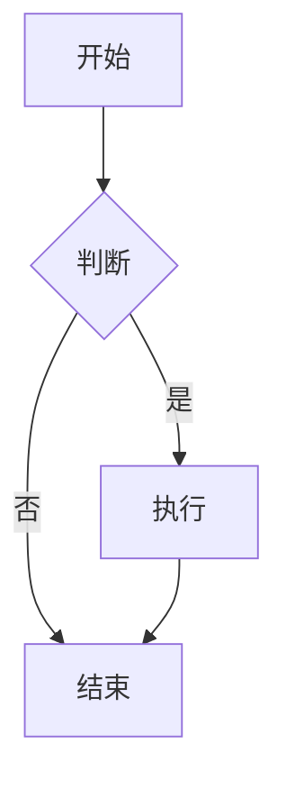

# 📖 Markdown 编辑器使用指南

## 🚀 快速开始

### 启动应用程序
```bash
npm install
npm run dev
```

访问 `http://localhost:3002/` 开始使用。

## 🎯 核心功能

### 1. 基础编辑
- **实时编辑**: 左侧编辑器，右侧实时预览
- **语法高亮**: 完整的 Markdown 语法高亮
- **自动保存**: 内容自动保存，无需担心丢失

### 2. 格式化快捷键
| 功能 | 快捷键 | 说明 |
|------|--------|------|
| 粗体 | `Ctrl+B` | **粗体文本** |
| 斜体 | `Ctrl+I` | *斜体文本* |
| 链接 | `Ctrl+K` | [链接文本](URL) |
| 标题 | `Ctrl+1-6` | # 各级标题 |
| 代码块 | `Ctrl+Alt+E` | ```代码块``` |
| 引用 | `Ctrl+Alt+Q` | > 引用文本 |
| 无序列表 | `Ctrl+Alt+U` | - 列表项 |
| 有序列表 | `Ctrl+Alt+O` | 1. 列表项 |
| 表格 | `Ctrl+Alt+T` | 插入表格 |
| 保存 | `Ctrl+S` | 手动保存 |

### 3. 工具栏功能

#### 左侧格式化工具
- **文本格式**: 粗体、斜体、链接、图片
- **结构元素**: 表格、列表、代码块、引用
- **标题快捷**: H1、H2、H3 快速插入

#### 右侧功能工具
- **拼写检查** ⭐: 实时拼写检查和建议
- **SEO分析** ⭐: 关键词分析和优化建议
- **图片压缩** ⭐: 高级图片压缩工具
- **大纲导航**: 基于标题的文档导航
- **版本历史**: 版本管理和恢复
- **导出功能**: PDF、HTML、图片等格式
- **主题切换**: 深色/浅色模式
- **全屏模式**: 专注编辑体验
- **设置**: 编辑器个性化设置

## 🎨 高级功能

### 1. SEO 优化分析
1. 点击工具栏的 📊 图标
2. 查看关键词分析、可读性评分
3. 获取 SEO 优化建议
4. 查看元数据信息

### 2. 拼写检查
1. 点击工具栏的 ✨ 图标
2. 查看拼写错误和建议
3. 添加自定义词典
4. 一键修正错误

### 3. 图片压缩
1. 点击工具栏的 🧊 图标
2. 拖拽或选择图片文件
3. 调整压缩参数
4. 下载或插入压缩后的图片

### 4. 动图支持
- 插入 WebP、APNG、GIF 动图
- 自动检测动图格式
- 播放/暂停控制
- 查看图片信息

### 5. 主题定制
1. 进入设置 → 主题
2. 选择预设主题或自定义
3. 调整颜色、字体、间距
4. 实时预览效果

### 6. 版本管理
1. 点击工具栏的 🕐 图标
2. 查看历史版本
3. 保存重要版本
4. 恢复到指定版本

## 📝 Markdown 语法支持

### 基础语法
```markdown
# 标题 1
## 标题 2
### 标题 3

**粗体** *斜体* ~~删除线~~

[链接](https://example.com)


> 引用文本

- 无序列表
1. 有序列表

`行内代码`

```代码块```
```

### 扩展语法 (GFM)
```markdown
| 表格 | 列1 | 列2 |
|------|-----|-----|
| 行1  | 数据 | 数据 |

- [x] 已完成任务
- [ ] 待完成任务

==高亮文本==
```

### 数学公式 (KaTeX)
```markdown
行内公式: $E = mc^2$

块级公式:
$$
\int_{-\infty}^{\infty} e^{-x^2} dx = \sqrt{\pi}
$$
```

### Mermaid 图表
```markdown

```

## ⚙️ 设置选项

### 编辑器设置
- **字体大小**: 12-20px 可调
- **行高**: 1.2-2.0 可调
- **编辑器宽度**: 30%-70% 可调
- **显示行号**: 开启/关闭
- **自动换行**: 开启/关闭
- **自动保存**: 开启/关闭

### 外观设置
- **主题模式**: 浅色/深色/跟随系统
- **自定义主题**: 颜色、字体、间距
- **标题样式**: 6种样式可选

### 预览设置
- **标题样式**: 默认、下划线、边框、渐变、现代、优雅
- **代码高亮**: 多种主题可选
- **数学公式**: KaTeX 渲染

## 🔧 快捷操作

### 文件操作
- **新建**: 清空编辑器内容
- **保存**: Ctrl+S 手动保存
- **导出**: 选择格式导出文件

### 编辑操作
- **撤销**: Ctrl+Z
- **重做**: Ctrl+Y
- **全选**: Ctrl+A
- **查找**: Ctrl+F
- **替换**: Ctrl+H

### 视图操作
- **全屏**: F11 或工具栏按钮
- **缩放**: Ctrl+Plus/Minus
- **重置缩放**: Ctrl+0

## 💡 使用技巧

### 1. 高效编辑
- 使用快捷键提高编辑效率
- 利用自动保存功能，专注内容创作
- 使用大纲导航快速跳转章节

### 2. 内容优化
- 定期使用 SEO 分析优化内容
- 利用拼写检查确保文本质量
- 使用版本管理保存重要节点

### 3. 视觉效果
- 选择合适的标题样式
- 使用动图增强表达效果
- 压缩图片优化加载速度

### 4. 个性化设置
- 调整编辑器布局适应工作习惯
- 自定义主题创造舒适环境
- 配置快捷键提高操作效率

## 🐛 常见问题

### Q: 内容没有自动保存？
A: 检查设置中的自动保存选项是否开启，默认每2秒自动保存一次。

### Q: 图片无法显示？
A: 确保图片路径正确，支持本地文件和网络链接。

### Q: 数学公式不渲染？
A: 确保使用正确的 LaTeX 语法，并用 $ 或 $$ 包围公式。

### Q: 主题设置不生效？
A: 刷新页面或重新应用主题设置。

### Q: 快捷键不工作？
A: 确保编辑器处于焦点状态，某些浏览器可能有快捷键冲突。

## 📞 技术支持

如果遇到问题或有功能建议，请：
1. 查看控制台错误信息
2. 检查浏览器兼容性
3. 尝试刷新页面或清除缓存
4. 联系技术支持团队

---

🎉 **享受高效的 Markdown 编辑体验！**
