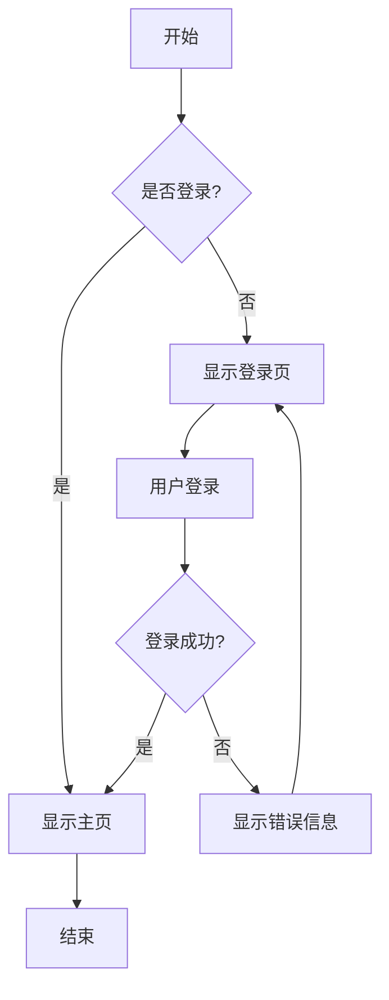
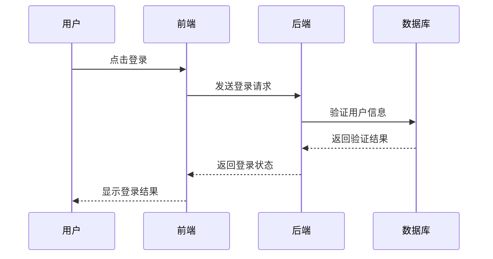
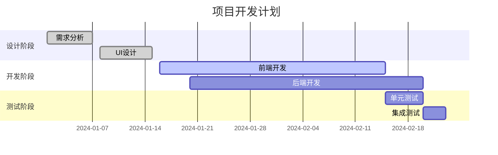
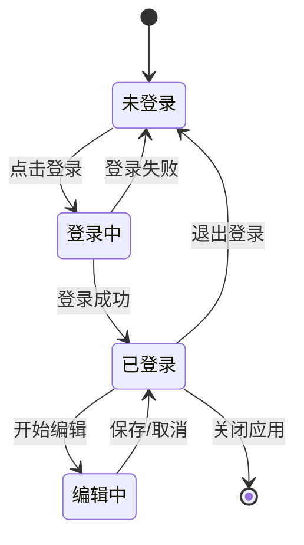
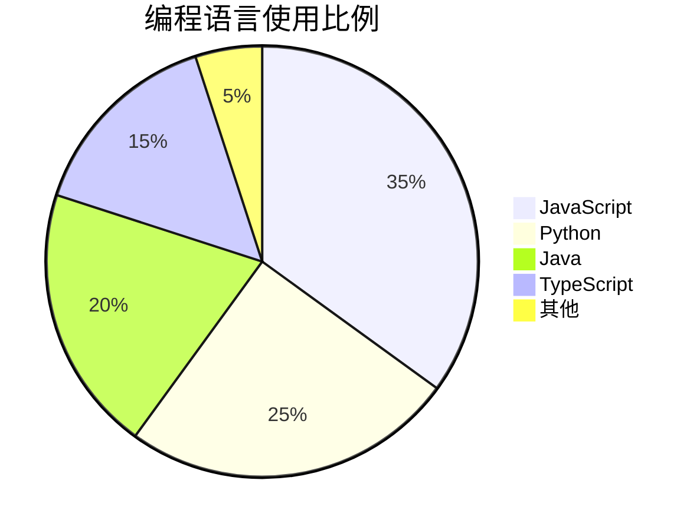

# Mermaid 测试文档

## 流程图测试



## 序列图测试



## 甘特图测试



## 类图测试

```mermaid
classDiagram
    class User {
        +String name
        +String email
        +String password
        +login()
        +logout()
        +updateProfile()
    }
    
    class Article {
        +String title
        +String content
        +Date createdAt
        +User author
        +publish()
        +edit()
        +delete()
    }
    
    class Comment {
        +String content
        +Date createdAt
        +User author
        +Article article
        +reply()
        +delete()
    }
    
    User ||--o{ Article : writes
    User ||--o{ Comment : writes
    Article ||--o{ Comment : has
```

## 状态图测试



## 饼图测试


