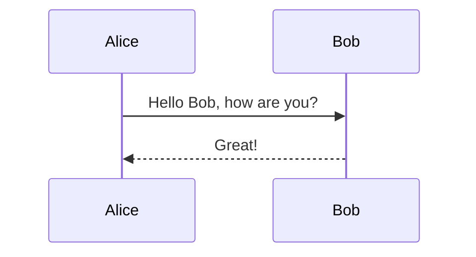

# 简单的Mermaid测试

这是一个简单的流程图测试：

```mermaid
graph LR
    A[开始] --> B[处理]
    B --> C[结束]
```

这是一个序列图测试：

```mermaid
sequenceDiagram
    Alice->>Bob: Hello Bob, how are you?
    Bob-->>Alice: Great!
```
